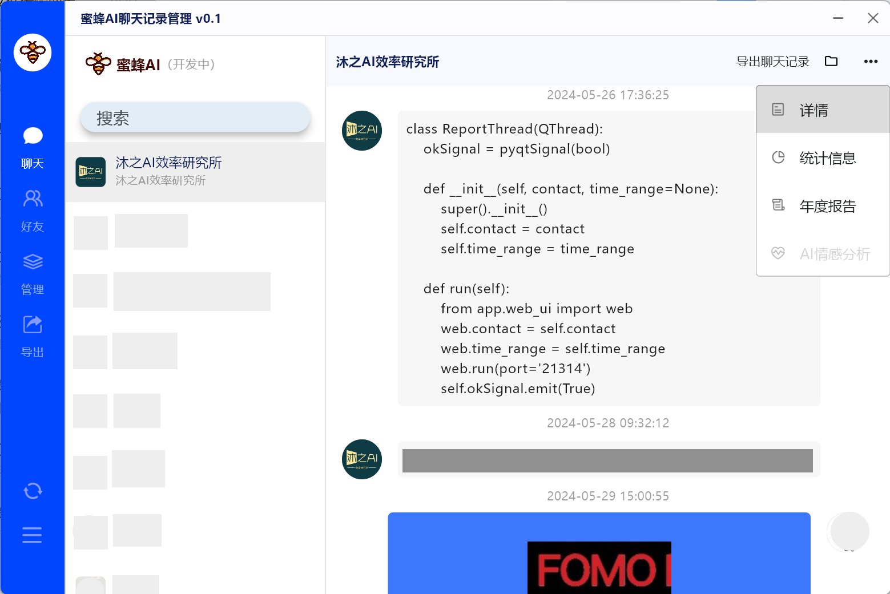
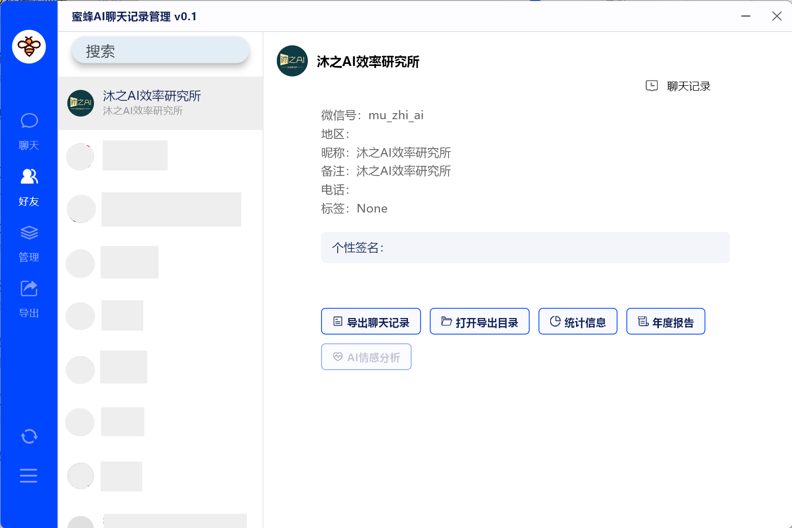
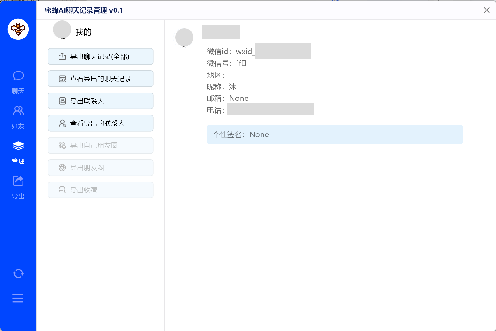
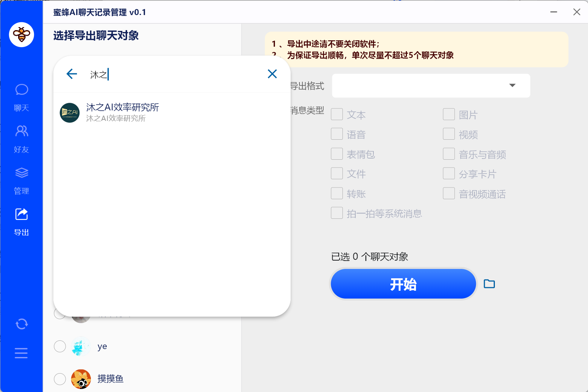
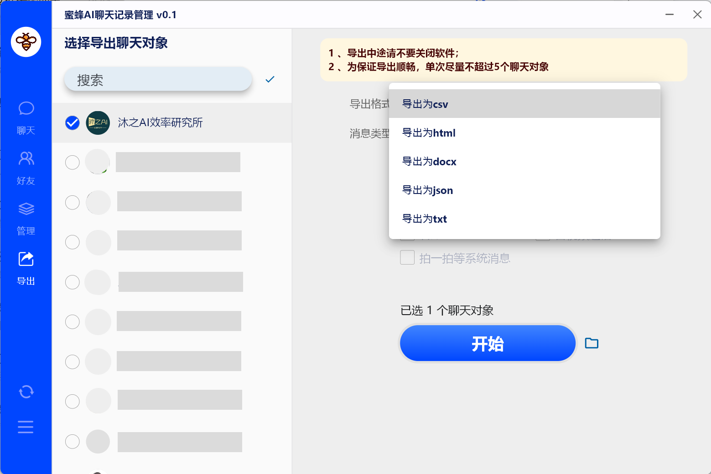
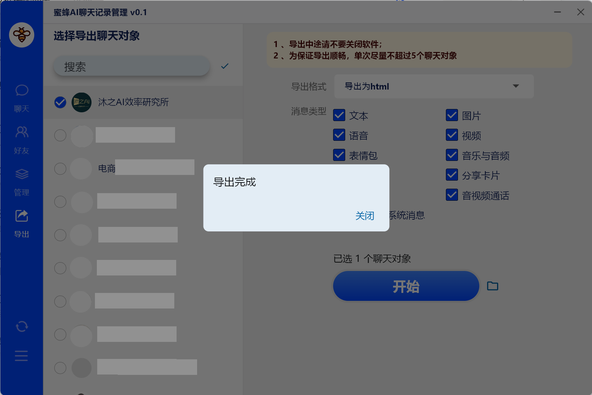
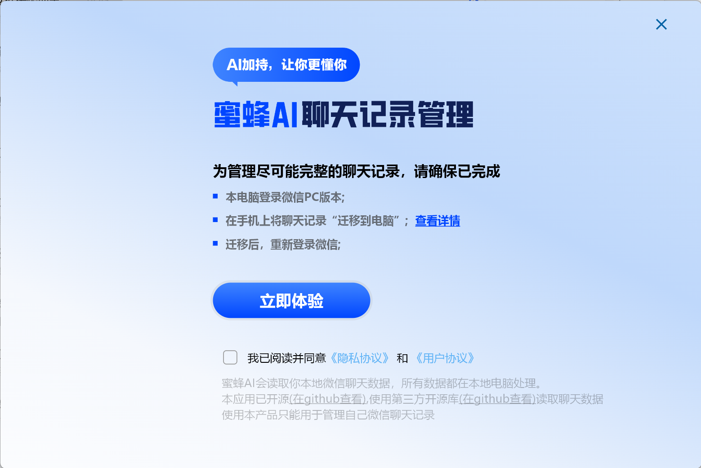

<h2 align="center">MyWeChatRecords</h2>
<h1 align="center">🐝蜜蜂AI聊天记录管理</h1>

<blockquote>

  

    <h2>前言</h2>
    

        
        
我们相信，微信中隐藏着独属于每个人的故事和情感。随着AI的到来，每个人都将能够拥有AI的陪伴，而我们的生活数据——包括个人的微信聊天记录——将能够赋予AI关于你过去的珍贵记忆。

        
我们希望 "MyWeChatRecords" 不仅仅是一个工具，它还是一种权利，让每个人都有能力留存自己的生活痕迹，而不是让这些宝贵的记忆被时间所遗忘。通过这个项目，我们能够将技术与情感相结合，让每个人都能够拥有并掌控自己的数据。

        
AI的发展不只是技术的提升，它还能延续每个人独属的情感。每一个对话、每一个互动都是生活中独一无二的片段，是真实而动人的情感交流。我们鼓励AI工作者们善用这些数据，用于培养独属于个体的人工智能。让个人AI成为生活中的朋友，能够理解、记录并分享我们的欢笑、泪水和成长。

        
我们期待AI成为生活的一部分，"MyWeChatRecords" 将助力每个人拥有自己的AI，将科技的便利与温情融入日常生活的每个细节。

    

  

</blockquote>

---
## 🐝功能

🔥**已完成**
- 🔒️🔑🔓️Windows本地微信数据库

- 界面功能
    - 还原微信聊天界面
      - 文本✅
      - 图片✅
      - 拍一拍等系统消息✅
    - 查看联系人信息✅
      - 搜索用户昵称定位联系人✅
      - 聊天记录统计✅
    - 搜索定位联系人✅
    - 查看个人微信账号信息✅
      - 导出所有联系人✅
    - 导出数据
      - 全选/取消全选✅
      - 批量导出✅
  

- 导出数据
    - 批量导出数据✅
    - 支持多账号数据导出✅
    - 导出联系人✅
    - sqlite数据库✅
    - HTML(文本、图片、视频、表情包、语音、文件、系统消息)✅
    - CSV文档✅
    - TXT文档✅
    - Word文档✅
    - json文档✅

- 分析聊天数据，做成[可视化年报]()

🔥**项目持续更新中**
- 开发计划
    - AI微调自己的聊天数据
    - 按日期导出聊天记录
    - 自定义选择导出的联系人
    - 过滤群聊聊天记录，仅显示勾选的用户
    - 仅导出群聊特定用户聊天记录
    - 群组年度报告
    - AI情感分析
    - 一键导出全部表情包、文件、图片、视频、语音
    - 合并多个备份数据
    - 按日期、关键词索引
    - 支持企业微信好友
- 小伙伴们想要其他功能可以留言哦📬
- 🔥项目正处于并将长期处于发展阶段，给我一些时间♾️，你所期望的未来都会实现（养成系开发者）
---
## 🐝界面

本项目 GUI 库 —— Flet 是 Google 团队在 2022 年推出的可免费商用的 Python GUI，能够轻松使用Python构建实时网页、移动和桌面应用，无需前端开发经验。

阅读Flet相关技术文档 

- 中文文档 - [Flet中文网](https://flet.qiannianlu.com/docs/)  
- 英文文档 - [Flet英文官网](https://flet.dev/docs/)

---
- 聊天界面

- 联系人界面

- 我的 / 管理界面

- 导出界面（搜索）

- 导出界面 (选择导出格式)

- 导出界面（导出成功提示）

- 微信数据加载界面

# ⌛使用

下载地址：

下载打包好的exe可执行文件，双击即可运行

## 源码运行

[详见开发者手册](./doc/开发者手册.md)

[AI聊天](./MemoAI/readme.md)

## PC端使用过程中部分问题解决（可参考）

#### 🤔如果您在pc端使用的时候出现问题，可以先参考以下方面，如果仍未解决，可以在群里交流~

* 不支持Win7
* 不支持Mac(未来或许会实现)
* 遇到问题四大法宝
    * 重启微信
    * 重启exe程序
    * 重启电脑
    * 换电脑
      如果您在运行可执行程序的时候出现闪退的现象，请右击软件使用管理员权限运行。

[查看详细教程](https://ktkzutzbtj.feishu.cn/wiki/Qq2QwbOFWi0rqLkhnEFcMRl5nMc)

# 🏆致谢

* WeChatMsg：[https://github.com/LC044/WeChatMsg](https://github.com/LC044/WeChatMsg)
* Flet中文网：[https://flet.qiannianlu.com/docs/](https://flet.qiannianlu.com/docs/)
* PC微信工具：[https://github.com/xaoyaoo/PyWxDump](https://github.com/xaoyaoo/PyWxDump)
* AI辅助编程：[ChatGPT](https://chat.openai.com/)

---
>
声明：该项目有且仅有一个目的：我的数据我做主，前提是必须是“我的数据”，其次才是“我做主”。禁止任何人以任何形式将其用于任何非法用途，对于使用该程序所造成的任何后果，所有创作者不承担任何责任🙄 
> 该软件不能找回删除的聊天记录，任何企图篡改微信聊天数据的想法都是无稽之谈。 
> 本项目所有功能均建立在”前言“的基础之上，基于该项目的所有开发者均不能接受任何有悖于”前言“的功能需求，违者后果自负。 
> 如果该项目侵犯了您或您产品的任何权益，请联系我删除 
> 软件贩子勿扰，违规违法勿扰，二次开发请务必遵守开源协议

## 感谢

再次感谢您的支持，这对项目的持续发展至关重要！

# 🎄温馨提示

如果您在使用该软件的过程中

* 发现新的bug
* 有新的功能诉求
* 操作比较繁琐
* 觉得UI不够美观
* 等其他给您造成困扰的地方

请提起[issue](https://github.com/youngWM/MyWeChatRecords/issues)，我将尽快为您解决问题

如果您是一名开发者，有新的想法或建议，欢迎[fork](https://github.com/youngWM/MyWeChatRecords/forks)
该项目并发起[pull requests](https://github.com/youngWM/MyWeChatRecords/pulls)，我将把您的名字写入贡献者名单中

# 联系方式

如果您遇到了问题，可以添加QQ群寻求帮助，由于精力有限，不能回答所有问题，所以还请您仔细阅读文档之后再考虑是否入群

## 加群方式

1. 关注官方公众号，回复：联系方式
2. QQ扫码入群

后续更新将会在公众号同步发布

  
  

## AI交流

欢迎对“前言”中AI感兴趣的加入QQ群（不负责任何答疑），让我们一起探讨新技术，钻研新方案，将科技的力量融入生活，打造出一个真正具有情感的个人AI

  

# License

WeChatMsg is licensed under [GPLv3](./LICENSE).

Copyright © 2024.
